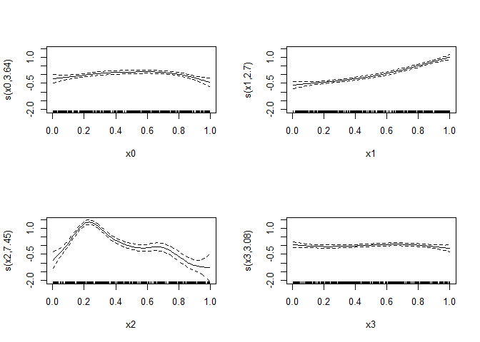

<!-- README.md is generated from README.Rmd. Please edit that file -->

# ziP0

`ziP0` is a small package that provides a joint binomial–Poisson
distribution family for use with `mgcv`.

It uses the same concept as the `ziP` family in `mgcv`, which is for a
zero-inflated Poisson distribution where the zero-inflation parameter is
related to the Poisson parameter, except that we are able to identify
which zeroes are fixed zeroes and which are zero counts. An example of
where this could be useful is in predicting the number of oocytes
retrieved in IVF cycles: zero oocytes could be retrieved because the
cycle is cancelled (fixed zeroes), and the probability of that occurring
is related to the expected number of oocytes.

Fixed zeroes should appear as `-1` in the data.

An example:

``` r
require(ziP0, quietly = TRUE)
#> This is mgcv 1.8-33. For overview type 'help("mgcv-package")'.
example(ziP0)
#> 
#> ziP0> # Generate joint binomial-Poisson random variables
#> ziP0> rzip0 <- function(gamma, theta = c(-2, 0.3)) {
#> ziP0+   # Poisson part
#> ziP0+   lambda <- exp(gamma)
#> ziP0+   y <- rpois(length(gamma), lambda)
#> ziP0+   # Binomial part
#> ziP0+   eta <- theta[1] + exp(theta[2])*gamma
#> ziP0+   p <- 1 - exp(-exp(eta))
#> ziP0+   ind <- (p > runif(length(y)))
#> ziP0+   y[!ind] <- -1
#> ziP0+   y
#> ziP0+ }
#> 
#> ziP0> set.seed(99)
#> 
#> ziP0> n <- 400
#> 
#> ziP0> dat <- gamSim(1, n = n)
#> Gu & Wahba 4 term additive model
#> 
#> ziP0> dat$y <- rzip0(dat$f/4 - 1)
#> 
#> ziP0> b <- gam(y ~ s(x0) + s(x1) + s(x2) + s(x3), family = ziP0(), data = dat)
#> 
#> ziP0> b
#> 
#> Family: Joint binomial-Poisson(-2.003,1.404) 
#> Link function: identity 
#> 
#> Formula:
#> y ~ s(x0) + s(x1) + s(x2) + s(x3)
#> 
#> Estimated degrees of freedom:
#> 3.64 2.70 7.45 3.08  total = 17.86 
#> 
#> REML score: 584.5717     
#> 
#> ziP0> plot(b,pages=1)
```

<!-- -->

## Installation

This relies on calling internal functions in `mgcv`, so will likely
never appear on CRAN ([“Also, `:::` should not be used to access
undocumented/internal objects in base
packages.”](https://cran.r-project.org/web/packages/policies.html#Source-packages-1)).
But you can install the development version from github:

``` r
# install.packages("devtools")
devtools::install_github("mdonoghoe/ziP0")
```
